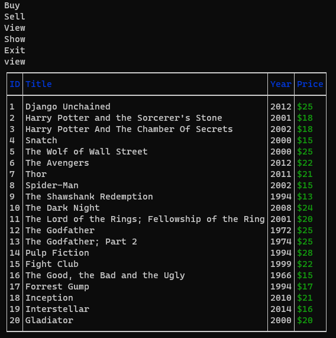

# Software Development Plan 

## Statement of Purpose and Scope

### Description 
MovieVerse is a command line interface application where people can buy, sell and discover a whole universe of movies. The purpose of this application is to help people who love movies to showcase their movie collection to other hobbyists with the option to sell them. They also get the opportunity to to discover even more movies with the option of buying movies from other enthusiasts, at a reasonable price of course. This application will allow users to enter a whole new dimension in the MovieVerse. 

### Problem 
When we enter a movie store, a video game store or a book store, it becomes really hard to find something that we like. People swap the places of products rapidly, they misplace them from where they usually have to be and this could effect our chances of finding the perfect movie. This application solves the problem of not being able to unite with the movie that you were destined to. With the opportunity to view the list of available movies, you will have the chance to find and view the details of the movie that is waiting for you. 

### Target Audience 
The target audience of this application is for anyone who knows how to launch command line interface applications with basic shell commands and anyone who can simply update the movie data in the beginning of their usage. The MovieVerse application does not only have to be used with movies. With simple configuration, the application can  be applied to other subjects such as video games, book, etc. 

### Usage
The target audience of this application will use the application through the terminal. In the beginning, they will have to update the movie list manually and then run the application with the `./run_app.sh` command. When the program starts running, there will be a list options to choose from and certain instructions for certain options. 

## Features
### User Interactivity 
The application is an interactive application which allows users to make selections on options that they want to choose. The options include Buy, Sell, View, Show and Exit. The user has to type in the option they want to execute from the command line with the keyboard. For Sell and View options, they can just type in "view" and "sell". For Show and Buy options, they have to input an extra ID input which matcheds with the ID of the movei they want to select. The input is not case sensitive so they can enter options in either uppercase or lower case. If they do not make a valid input, the program reasks for input and if they choose the exit option program stops running. 

### Loading Data From a File System
The application collaborates with the file system. It interacts with a YAML file and is able to save and delete to the file. The file does not lose progress when the application stops running. In the initial stage, users can input multiple data with properties such as id, title, year and price manually and the program calls the data from the file and is able to display, delete and add to items. 

### CRUD
* Sell
The Sell functionality acts as a create method. When the Sell option is chosen in the program, it asks the user for a title, year and price. It collects that data and saves it to the file, assigning a unique ID for each movie.
* Buy 
The Buy functionality acts as a delete method. When the user chooses the buy option with a valid ID, the program locates the item with that specific ID and removes it from the file. 
* View 
The View functionality acts as a display method. It finds all the movies in the file and displays them in a table.

## User Interaction and Experience 
The application starts with a basic screen with options. User has to type in the option they want to execute.

To view the list of movies in the file, user types in view and a list of all the movies show up on the screen in a table.

To sell a movie, users type in sell and a series of details that need need to be completed appear. User types in the title of the movie, then types in the year movie was realeased. If the year input is not between 1950 - 2021, they have to re-enter a valid year. For the price offer, if the user tries to offer more than 15 dollars, the program rejects the offer and asks again.

To show the details of a specific movie, user types in show and then enters an ID with a space in between, e.g(show 17). The program finds that movie in the file system with its unique ID and displays it in a table. 

To buy a movie, users type in buy and an ID, like the one in show method, and the program detects that movie in the file system and removes it. 

## Implementation

[Link To Trello Board](https://trello.com/b/0Th9aFZR/agile-movie-board)

## Control Flow 

## Help Documentation 

### Installation 

- You will need to have Ruby installed on your computer. For instructions on downloading Ruby, see [Download and Install Ruby](https://www.ruby-lang.org/en/documentation/installation/)

- Install the project on your computer with the command 

` git clone https://github.com/ahmetterturk/MovieVerse-Terminal_Applicaion.git `

- You will need to have the bundler gem installed in you computer. To install bundler run 

` $ gem install bundler `

- To download dependencies, run the following command

` $ bundle install `

- To run the application, simply type the following command in the terminal

` $ ./run_app.sh ` 

### Dependencies 
- Please make sure the following dependencies are installed on your computer 

` gem "tty-table", "~> 0.12.0" ` 

` gem "pastel", "~> 0.8.0" `

` gem "colorize", "~> 0.8.1" `

` gem "rspec", "~> 3.10" `

